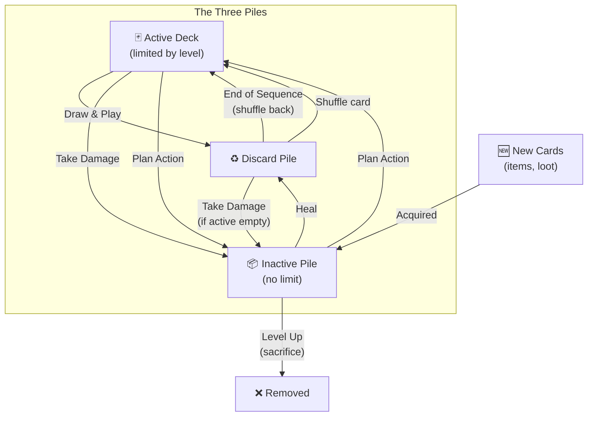

# ZoomQuest - Rules

## Overview

ZoomQuest is a cooperative medieval fantasy game for 1-5 players. Players control characters navigating a network of locations fighting monsters, finding treasures, and learning secrets.

---

## Core Mechanics

### The Basics

Each entity in the game is represented as a hand of cards. Each card represents actions like attacking with a sword, sneaking through the shadows, or fast-talking. Battles and other interactions are modelled by every participant laying out their hand in order, almost like the terrible kid's card game War. In this way almost everything about your character's tactics and behavior is a matter of arranging what's in your hand - and in what order. Outside of these "action sequences" players can move to connected locations or spend a turn arranging their hand and moving cards to and from an "inactive" deck to control what they'll do next.

**Map**: The game takes place on a network of locations connected by paths. Each location can contain players and enemies.

**Cards = Health**: Each entity (player or monster) has a deck of cards. These cards represent both their abilities AND their health. When you take damage, cards move to your inactive pile. When your active and discard piles are both empty, you are defeated.

**Three Piles**:
- **Active Deck**: Cards available to draw (limited by character level)
- **Discard Pile**: Cards that have been played (shuffled back at end of sequence)
- **Inactive Pile**: Stored cards - damaged cards go here, new acquisitions go here

**Character Level**: Each character has a level (starting at 5) which determines the maximum size of their active deck. The inactive pile has no limit.

### Card Movement Between Piles

Cards flow between the three piles in specific ways:



**Summary of card movement:**
| From | To | How |
|------|-----|-----|
| Active | Discard | Playing a card |
| Discard | Active | End of sequence (shuffle) or Shuffle card |
| Active/Discard | Inactive | Taking damage |
| Inactive | Discard | Being healed |
| Inactive ↔ Active | Either direction | Plan action |
| (new) | Inactive | Acquiring items/loot |
| Inactive | (removed) | Level up sacrifice |

### Turn Structure

Each **turn** has two phases:

**Phase 1: Move or Plan**
- Choose to move to an adjacent location, or stay put
- If staying, you can choose **Action** (participate in combat) or **Plan** (skip combat, manage deck)
- All players reveal moves simultaneously

**Phase 2: Action Sequence**
- At each location with hostile entities, an action sequence occurs
- Players who chose "Plan" do not participate
- Action sequences consist of multiple **rounds** until one side is eliminated

### The Plan Action

When you choose to **Plan** instead of acting:
- You skip the action sequence at your location (you don't fight)
- You can move cards between your Active and Inactive piles
- Active deck is limited to your character level
- You can reorder your active deck (top card is drawn first)

This is useful for:
- Preparing specific cards for an upcoming battle
- Storing powerful cards for later
- Setting up for a level up

### Action Sequence Resolution

Each **round** within an action sequence:

1. All entities draw their top card
2. Cards resolve in order: Watch → Sneak → Mark → Attack → Defend → Combat → Poison → Heal → Shuffle → Commerce
3. Combat resolves: Defend cancels Attack (1:1), remaining attack = damage
4. Damaged entities have cards moved to their inactive pile
5. All played cards go to discard piles
6. **All markers decrement by 1** (markers at 0 are removed)
7. Repeat until one side is eliminated or all are out of cards

### Markers

Many cards place **markers** on entities. Markers represent ongoing effects:

- Markers have a **count** that decrements by 1 at the end of each round
- When a marker reaches 0, it expires
- Some markers are consumed when used (e.g., sneak bonus damage)

**Example**: Playing Sneak (Power 2) gives you 2 sneak markers. At the end of the round, this becomes 1. If you don't attack, it becomes 0 and you're visible again.

### Victory & Defeat

- **Win**: Achieve the scenario's victory condition (usually: defeat all enemies)
- **Lose**: All players are defeated
- **Defeated**: An entity is defeated when their active deck AND discard pile are both empty

---

## Fog of War

Scenarios can limit what players can see based on their character's location.

**Entity Visibility** (`entity_visibility`):
- How many locations away you can see other entities
- `0` = See all entities everywhere
- `1` = Only see entities at your current location
- `2` = See entities at your location and adjacent locations (default)

**Location Visibility** (`location_visibility`):
- How many locations away you can see the map itself
- `0` = See entire map
- `1` = Only see your current location
- `2` = See your location and adjacent locations

**Important**: Fog of war is purely visual. Mechanics work normally - if you move to a location with hidden enemies, combat still occurs.

---

## Example Playthrough: The Test Scenario

### Setup

The **test_0** scenario has 4 locations connected in a simple network:

```
         [Stables] -------- Gut Lane -------- [Farm]
              |                                  |
         South Trail                        Farm Track
              |                                  |
          [South Road] ----- Tricky Track ----- [Illplaced]
```

**Starting positions:**
- All players start at the Farm
- A Bandit is at South Road (has 2 cards: Cutlass, Parry)
- A Goblin is at Illplaced Farm (has 5 cards)

### Turn 1: Movement

The players discuss strategy. Bob the Warrior (5 attack cards) decides to go after the Bandit.

**Move choice**: Bob moves from Farm → South Road via Farm Track

**Result**: Bob arrives at South Road where the Bandit waits.

### Turn 2: Battle Begins

Bob and the Bandit are now at the same location. An action sequence begins.

**Round 1 - Draw Phase:**
- Bob draws: **Greatsword** (Attack, Power 2)
- Bandit draws: **Cutlass** (Attack, Power 1)

**Marker Placement:**
- Bob's Greatsword places 2 attack markers on the Bandit
- Bandit's Cutlass places 1 attack marker on Bob

**Combat Resolution:**
- Bandit has 2 attack markers, 0 defend → takes 2 damage → 2 cards to inactive!
- Bob has 1 attack marker, 0 defend → takes 1 damage → 1 card to inactive

**Result:**
- Bandit only had 2 cards total - both gone to inactive! **Bandit is defeated!**
- Bob has 4 cards remaining

**Items**: The Bandit drops a Rusty Sword, which Bob picks up.

### Turn 3: Continue the Hunt

Bob now moves toward Illplaced Farm to help deal with the Goblin...

---

## Advanced Rules

### Leveling Up

When your **Inactive pile** has cards equal to or greater than your current level, you can **Level Up** during a Plan action:

1. Choose exactly LEVEL cards to sacrifice (from either Active or Inactive)
2. Those cards are permanently removed from the game
3. Your level increases by 1
4. Your active deck capacity increases by 1

**Example**: At level 5 with 6 inactive cards, you can sacrifice 5 cards to become level 6. Your active deck can now hold 6 cards.

**Strategy Tips**:
- Sacrifice weaker cards to make room for better ones
- Higher levels mean more cards in play during combat
- Balance offense and defense as your deck grows

### Factions

Each entity belongs to a faction. Faction relationships determine targeting:

| Relationship | Attack | Defend/Heal | Sneak Visibility |
|-------------|--------|-------------|------------------|
| Hostile | Can target | Cannot target | Attacks reveal |
| Friendly | Cannot target | Can target | Shared benefit |
| Neutral | Cannot attack | Cannot defend | Allows commerce |

Default factions:
- **Players**: Hostile to goblins and bandits
- **Goblins**: Hostile to players and merchants
- **Bandits**: Hostile to players
- **Merchants**: Neutral to players, hostile to goblins

### Targeting Rules

When a card is drawn, targets are determined automatically:

- **Attack/Poison/Mark** → Targets the visible hostile entity with the lowest health
- **Defend/Heal** → Targets the friendly entity with the lowest health
- **Self-targeting cards** (Sneak, Watch, Shuffle, Sell) → Always target self

**Health** = Active deck + Discard pile (not inactive cards)

Hidden entities (with sneak markers) cannot be targeted by hostile actions.

Ties are broken randomly.

---

## Advanced Examples

### Example: Sneak Attack

Erik the Rogue has been building up sneak markers:
- Round 1: Plays **Cloak** (Sneak, Power 2) → gains 2 sneak markers, becomes hidden
- Round 2: Plays **Shadow Step** (Sneak, Power 1) → gains 1 more sneak marker (3 total)
- Round 3: Plays **Backstab Dagger** (Attack, Power 1) at the Goblin

When attacking from hidden:
- Consumes 1 sneak marker to allow the attack
- Remaining 2 sneak markers add +2 bonus damage
- Base attack (1) + Sneak bonus (2) = **3 total damage!**

The Goblin is defeated without ever seeing Erik coming.

**Note**: At the end of each round, sneak markers decrement. So if Erik waits too long, his stealth expires!

### Example: Coordinated Defense

Alice the Cleric and Bob the Warrior are fighting a powerful enemy together.

**Draw Phase:**
- Enemy draws: **Crushing Blow** (Attack, Power 3) → targets Bob (lowest health)
- Alice draws: **Blessed Shield** (Defend, Power 2) → targets Bob
- Bob draws: **Greatsword** (Attack, Power 2) → targets Enemy

**Resolution:**
- Enemy places 3 attack markers on Bob
- Alice places 2 defend markers on Bob
- Bob attacks enemy for 2 damage

**Combat:**
- Bob has 3 attack markers, 2 defend → 2 cancelled → 1 damage taken
- Enemy has 2 attack markers → 2 damage taken

Alice's shield saved Bob from 2 points of damage!

### Example: Poison and Heal

The Goblin has poisoned Charlie with **Poison Spit** (Power 2), giving Charlie 2 poison markers.

If left untreated:
- End of sequence: Each poison marker deals 1 damage
- Charlie takes 2 damage from poison alone!

Diana the Paladin plays **Lay on Hands** (Heal, Power 2) targeting Charlie:
1. First, removes 2 poison markers (all removed!)
2. No heal power remaining, but Charlie is cured

If Diana had Power 3, she could cure the poison AND restore 1 card from inactive.

### Example: Commerce

A Merchant is at the Town Square with items for sale.

**Round 1:**
- Merchant plays **Sell** (Power 2) → places 2 sell markers (minimum price: 2)
- Erik plays **Wealth** (Power 3) → has enough to buy!

**Resolution:**
- Erik pays (3 ≥ 2 required) and receives the Merchant's item
- The item might be a new weapon card added to Erik's deck!

### Example: Watch vs Steal

Erik tries to steal from a watchful Merchant:
- Merchant has 2 watch markers
- Erik plays **Pickpocket** (Steal, Power 1)

**Resolution:**
- Watch cancels Steal 1:1
- 1 watch marker consumed, 1 steal cancelled
- Erik is caught! Steal fails.
- Merchant still has 1 watch marker remaining

---

## Game Flow Summary

```
┌─────────────────────────────────────────────────────────────┐
│                      TURN START                              │
└─────────────────────────────────────────────────────────────┘
                           ↓
┌─────────────────────────────────────────────────────────────┐
│              PHASE 1: MOVE/PLAN SELECTION                    │
│  All players secretly choose:                                │
│   • Move to adjacent location                                │
│   • Stay + Action (participate in combat)                    │
│   • Stay + Plan (manage deck, skip combat)                   │
└─────────────────────────────────────────────────────────────┘
                           ↓
┌─────────────────────────────────────────────────────────────┐
│              PHASE 2: RESOLVE MOVES                          │
│  All moves revealed and executed simultaneously              │
│  Players who chose Plan: rearrange active/inactive decks     │
└─────────────────────────────────────────────────────────────┘
                           ↓
┌─────────────────────────────────────────────────────────────┐
│        PHASE 3: ACTION SEQUENCES (per location)              │
│  Players who chose Plan do NOT participate                   │
│  ┌─────────────────────────────────────────────────────┐    │
│  │ Each ROUND:                                         │    │
│  │ 1. Draw cards                                       │    │
│  │ 2. Resolve in order: Watch → Sneak → Mark →        │    │
│  │    Attack → Defend → Combat → Poison → Heal →      │    │
│  │    Shuffle → Commerce                               │    │
│  │ 3. Cards go to discard                              │    │
│  │ 4. All markers decrement by 1                       │    │
│  │ 5. Check for defeated entities                      │    │
│  │ 6. Repeat until sequence ends                       │    │
│  └─────────────────────────────────────────────────────┘    │
└─────────────────────────────────────────────────────────────┘
                           ↓
┌─────────────────────────────────────────────────────────────┐
│              END OF SEQUENCE                                 │
│  • Apply poison damage (cards → inactive)                    │
│  • Clear remaining markers                                   │
│  • Items transfer from defeated enemies                      │
└─────────────────────────────────────────────────────────────┘
                           ↓
┌─────────────────────────────────────────────────────────────┐
│              CHECK VICTORY                                   │
│  Win? Lose? Or continue to next turn...                      │
└─────────────────────────────────────────────────────────────┘
```

---

## Reference

### Card Types

| Card | Icon | Effect |
|------|------|--------|
| **Attack** | ⚔️ | Places attack markers on lowest-health hostile. Power = damage dealt. |
| **Defend** | 🛡️ | Places defend markers on lowest-health friendly. Each point blocks 1 attack. |
| **Heal** | ❤️ | Removes poison first, then restores cards from inactive. Targets lowest-health friendly. |
| **Poison** | 🧪 | Places poison markers on hostile. Each marker deals 1 damage at end of sequence. |
| **Sneak** | 👤 | Places sneak markers on self. Hidden entities can't be targeted. Attack from hidden consumes 1 marker, remaining add bonus damage. |
| **Watch** | 👁️ | Places watch markers on self. Cancels sneak and steal (1:1). |
| **Mark** | 🎯 | Places mark markers on hostile. All attacks against marked targets deal +1 damage per mark. |
| **Shuffle** | 🔄 | Moves cards from discard to active deck. Power = number of cards. |
| **Sell** | 💰 | Places sell markers on self (minimum price for commerce). |
| **Wealth** | 💎 | Can purchase items from sellers if power ≥ their sell markers. |
| **Steal** | 🗝️ | Steals items from neutral entities. Cancelled by watch markers. |

### Resolution Order (Detailed)

Each round follows a strict 13-phase resolution process. The key design principle is that **targeting is determined at resolution time, not at draw time**. This allows earlier phases to affect later targeting (e.g., sneak cards make you invisible before attack cards pick targets).

#### Phase 1: Place Watch Markers
- Watch cards place markers on self
- Power = number of markers placed

#### Phase 2: Watch vs Sneak Resolution
- Existing sneak markers are cancelled by watch markers (1:1)
- Both types consumed in the process

#### Phase 3: Place Sneak Markers
- Sneak cards place markers on self
- Entities with sneak markers become "hidden"

#### Phase 4: Place Mark Markers
- **Targeting happens NOW**: finds lowest-health visible hostile
- Mark cards place markers on target
- Marked entities take bonus damage from attacks

#### Phase 5: Place Attack Markers
- **Targeting happens NOW**: finds lowest-health visible hostile
- Hidden entities (with sneak markers) cannot be targeted
- If attacker has sneak markers: consume 1 to attack, remaining add bonus damage
- Power + sneak bonus + mark bonus on target = total attack markers placed

#### Phase 6: Place Defend Markers
- **Targeting happens NOW**: finds lowest-health friendly (can defend hidden allies)
- Defend cards place markers on target

#### Phase 7: Combat Resolution
- For each entity with attack markers:
  - Defend markers cancel attack markers 1:1
  - Remaining attack markers = damage taken
  - Damage moves cards from active → inactive (or discard → inactive if active empty)
  - If active AND discard are empty → entity is defeated

#### Phase 8: Place Poison Markers
- **Targeting happens NOW**: finds lowest-health visible hostile
- Poison cards place markers on target
- Poison damage applies at end of sequence

#### Phase 9: Resolve Heal
- **Targeting happens NOW**: finds lowest-health friendly
- First removes poison markers from target (1:1 with power)
- Remaining power restores cards from inactive → discard

#### Phase 10: Resolve Shuffle
- Self-targeting
- Moves cards from discard → active (up to power)

#### Phase 11: Place Sell Markers
- Self-targeting
- Sell cards place markers on self
- Power = minimum price for purchases

#### Phase 12: Resolve Wealth/Buy
- **Targeting happens NOW**: finds entity with sell markers
- If power ≥ seller's sell markers: purchase succeeds
- Buyer receives one item from seller's inventory
- Seller's sell markers are cleared

#### Phase 13: Resolve Steal
- **Targeting happens NOW**: finds neutral entity with items
- Watch markers cancel steal (1:1)
- If not cancelled: steal one item from target

#### After All Phases
- All drawn cards move to their owner's discard pile
- Round is marked as resolved

#### End of Round (between rounds)
- All markers on all entities decrement by 1
- Markers that reach 0 are removed
- Check if sequence should continue or end

### Resolution Order (Summary)

Cards resolve in this order each round:
1. Watch (place markers)
2. Watch vs Sneak (mutual cancellation)
3. Sneak (hide)
4. Mark (bonus damage setup)
5. Attack (place damage markers)
6. Defend (place block markers)
7. Combat Resolution (apply damage)
8. Poison (DOT setup)
9. Heal (cure and restore)
10. Shuffle (deck recovery)
11. Sell (set price)
12. Wealth/Buy (purchase)
13. Steal (take items)

### Individual Goals

Each player may have a secret individual goal for bonus points:

| Goal | Icon | Description |
|------|------|-------------|
| Explorer | 🗺️ | Visit X unique locations |
| Slayer | 💀 | Deal X killing blows |
| Protector | 🛡️ | Block X attacks for allies |
| Shadow | 🥷 | Play Sneak X times |
| Pacifist | 🕊️ | End with 0 killing blows |
| Settler | 🏠 | Spend X turns in towns |
| Wanderer | 🧭 | Spend X turns in wilderness |
| Vanguard | ⬆️ | Spend X turns in northern locations |
| Rearguard | ⬇️ | Spend X turns in southern locations |
| Goblin Hunter | 👺 | Kill X goblins |
| Bandit Hunter | 🗡️ | Kill X bandits |

Goals are revealed at game end for bonus scoring.

### Scenario Configuration

Scenarios can set these visibility options:

| Setting | Default | Description |
|---------|---------|-------------|
| `entity_visibility` | 2 | How far to see entities (0=all) |
| `location_visibility` | 2 | How far to see map locations (0=all) |

Distance is measured in location hops. Value of 1 = current location only. Value of 2 = current + adjacent.
